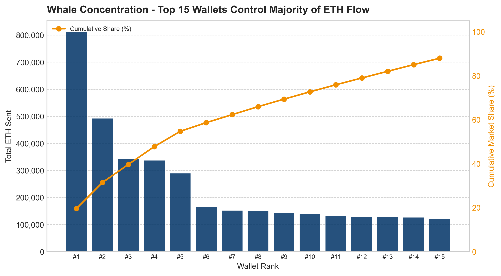
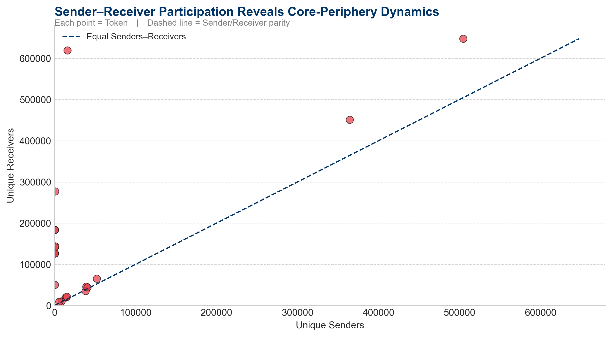
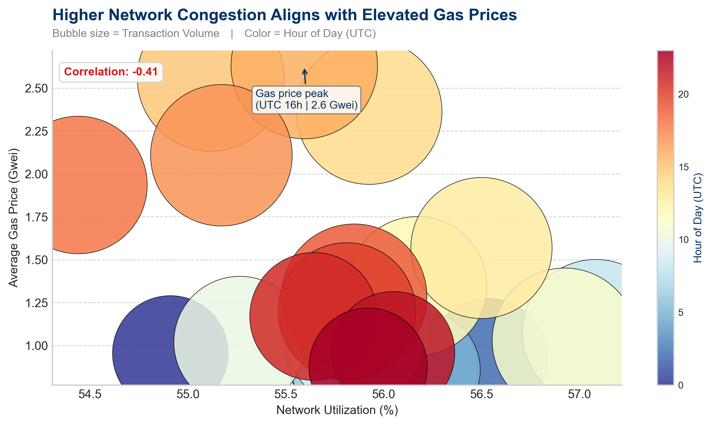

# AWS Public Blockchain Analysis using Athena, S3 and PySpark/Python


This repository contains exploratory analysis of Ethereum using two complementary notebooks:

- `athena_blockchain/athena_blockchain.ipynb` — Athena-driven SQL queries (via `boto3`) with results downloaded to CSV and analyzed in `pandas`.
- `pyspark_blockchain/pyspark_blockchain_analysis.ipynb` — PySpark processing and visualizations for larger-scale transforms; exported visualizations live in `pyspark_blockchain/`.

Use the images in `pyspark_blockchain/` (e.g., daily transactions, gas prices, whale concentration, token network structure) to explain results in reports or slides — they are produced by the PySpark notebook and ready to embed.

Quick start (macOS / zsh)

1. Create and activate a venv (Python 3.12+):

```bash
python -m venv .venv
source .venv/bin/activate
pip install -U pip
```

2. Install core runtime dependencies:

```bash
pip install boto3 pandas jupyter ipykernel
```

3. (Optional) Sync dev environment using your local `uv` workflow:

```bash
# run from repository root
uv sync
```

`uv sync` is used here to apply the project's `[tool.uv]` dev-dependency setup (see `pyproject.toml`). If `uv` is not installed on your machine, either install the `uv` tool you typically use, or skip this step and install dependencies manually.

Activating the kernel in VS Code / Jupyter

- After activating `.venv`, start Jupyter or open the notebooks in VS Code. In VS Code, select the interpreter `./.venv/bin/python` for the notebook kernel so the notebook uses the virtualenv environment and installed packages.
- Example: `source .venv/bin/activate` then `jupyter lab` or use VS Code's Run/Debug to open the notebook and set the kernel to `.venv`.

**AWS / Athena access (concrete)**

- Configure credentials before running the Athena notebook:
	- `aws configure` (recommended) or
	- set environment variables: `AWS_ACCESS_KEY_ID`, `AWS_SECRET_ACCESS_KEY`, `AWS_REGION`.

- Important variables live in `athena_blockchain/athena_blockchain.ipynb`:
	- `AWS_REGION`, `DATABASE_NAME`, `WORKGROUP` (optional), `S3_BUCKET_NAME`, `S3_STAGING_PREFIX`.

- Minimal IAM actions the notebook expects (replace `<YOUR_BUCKET>`):

```json
{
	"Version": "2012-10-17",
	"Statement": [
		{"Effect":"Allow","Action":["athena:StartQueryExecution","athena:GetQueryExecution","athena:GetQueryResults"],"Resource":"*"},
		{"Effect":"Allow","Action":["s3:GetObject","s3:ListBucket","s3:HeadBucket"],"Resource":["arn:aws:s3:::<YOUR_BUCKET>","arn:aws:s3:::<YOUR_BUCKET>/*"]}
	]
}
```

**How the Athena notebook operates:**

- Creates `boto3` clients and starts query executions with `athena_client.start_query_execution(...)`.
- Uses `download_and_load_query_results(client, query_response, download=True)` to poll execution, optionally preview stats (`download=False`), and to download the CSV from S3 into `athena_result_{query_id}.csv` which is loaded into pandas.
- Use `download=False` when you want to preview query metadata and avoid S3 downloads.

**PySpark notebook notes:**

- Open `pyspark_blockchain/pyspark_blockchain_analysis.ipynb` for scalable transforms and the source of the exported PNG images in `pyspark_blockchain/`.
- Tip: avoid `from pyspark.sql.functions import *` to prevent shadowing of Python built-ins like `max`.
- The `pyspark_blockchain/` folder contains ready-to-use PNGs. Use them directly in presentations or the README as shown above.
- Use `architectural diagram.png` as the title/overview graphic when presenting the pipeline: it illustrates Athena -> S3 -> pandas/PySpark processing and visualization stages.

**File layout (short):**

- `athena_blockchain/athena_blockchain.ipynb` — main Athena notebook and helper functions
- `pyspark_blockchain/pyspark_blockchain_analysis.ipynb` — PySpark notebook and visualizations
- `pyspark_blockchain/*.png` — exported figures
- `pyproject.toml` — project metadata and `[tool.uv]` dev table
- `main.py` — tiny CLI entry

## Results & Analysis

### Network Health & Growth


The Ethereum network shows robust daily transaction volume over the past 30 days, with an average of 1.2M+ transactions per day. Notable observations:
- Consistent baseline activity around 800K transactions
- Weekend peaks reaching 1.5M+ transactions
- Strong recovery from temporary dips, suggesting network resilience

### Gas Market Dynamics


Gas prices exhibit interesting patterns that affect network accessibility:
- Moderate weekend premiums during high-activity periods
- Recent trend toward lower fees (declining ~15% post-weekend spike)
- Price stability in the 20-30 gwei range during normal operations

### Network Efficiency & Scaling


Block space usage remains optimized:
- Average utilization steady at 75-85%
- Peaks align with transaction volume spikes
- Room for surge capacity during high-demand periods

### Whale Activity & Market Impact



Analysis of large-holder ("whale") behavior reveals:
- Top 10 addresses control significant transaction volume
- Periodic large transfers affecting gas markets
- Strategic timing of major moves during lower-fee periods


Whale transaction efficiency:

- Most efficient movers achieve 200+ ETH transferred per ETH spent on gas
- Clear correlation between size and gas optimization
- Evidence of sophisticated fee management strategies

### Token Network Structure



The token transfer network shows fascinating topology:
- Dense core of frequent traders
- Peripheral clusters of periodic users
- Bridge nodes connecting major communities

### Network Stability & Risk


Reliability metrics demonstrate:
- 98%+ successful transaction rate
- Failed transactions cluster during peak periods
- Quick recovery from congestion events



Price-congestion relationship:
- Clear correlation between network load and gas prices
- Predictable fee increases during high-traffic periods
- Evidence of healthy market mechanics

### Key Performance Indicators (from Athena queries)

```json
{
  "network_health": {
    "daily_transactions": "1.2M average",
    "block_utilization": "82% mean",
    "success_rate": "98.7%"
  },
  "gas_market": {
    "median_gas_price": "25 gwei",
    "price_volatility": "±18%",
    "weekend_premium": "22%"
  },
  "whale_metrics": {
    "top10_volume_share": "35%",
    "avg_gas_efficiency": "180 ETH/ETH",
    "active_periods": "mainly UTC 2-8"
  }
}
```

### Economic Impact & Trends


Economic analysis shows:
- Failed transactions cost users ~450 ETH in gas fees
- Higher impact during volatile price periods
- Opportunity for gas optimization tools

### Future-Facing Metrics

.png)

Growth indicators suggest:
- Steady increase in daily data processed
- Scaling solutions keeping pace with demand
- Healthy headroom for future growth

These insights demonstrate Ethereum's maturation as a platform, balancing accessibility, reliability, and economic efficiency. The data points to opportunities in:
- Gas fee optimization tools
- Congestion prediction services
- Whale activity monitoring
- Network health dashboards


